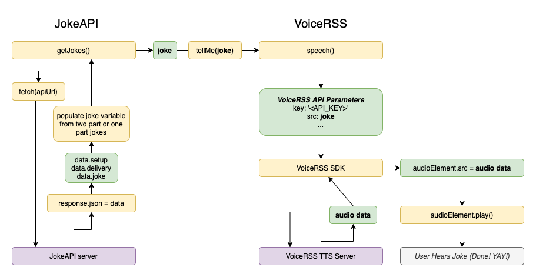

# Joke Teller

4th Project from the course https://www.udemy.com/course/javascript-web-projects-to-build-your-portfolio-resume


Published here: https://makadown.github.io/joke-teller/index.html

## Flowchart



## Resources

Rapid API (recursos para texto a voz)
```
https://rapidapi.com/collection/best-text-to-speech-apis
```

Voice RSS (requiere registro)
```
http://www.voicerss.org/
```

Joke API
```
https://sv443.net/jokeapi/v2/
```

Mozilla Doc (Fetch)
```
https://developer.mozilla.org/en-US/docs/Web/API/Fetch_API/Using_Fetch
```